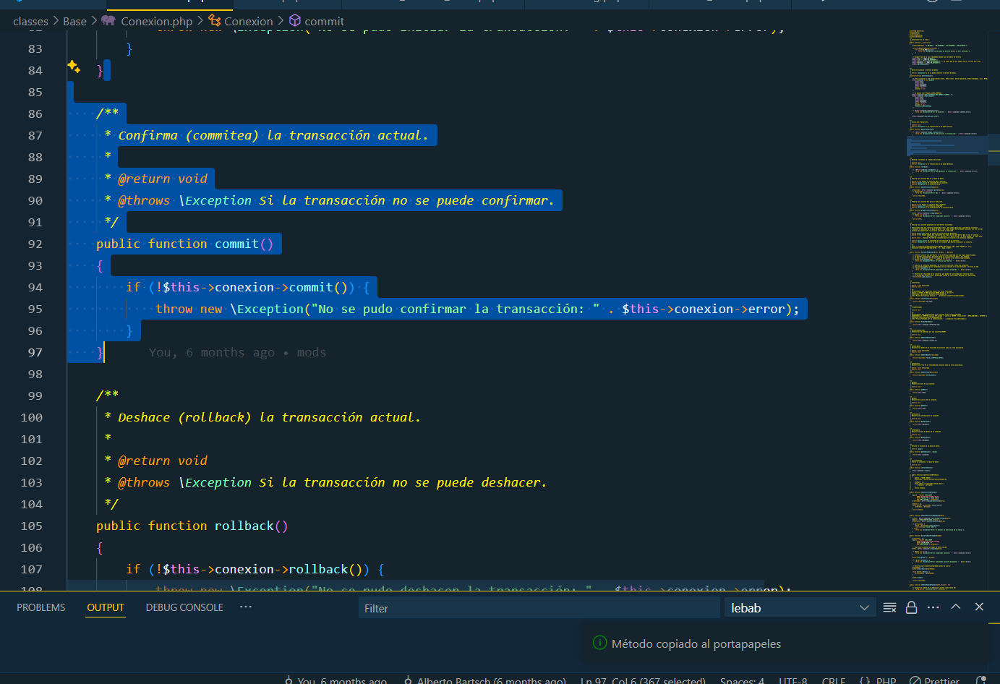

# Select PHP Method

## Descripción
Esta extensión para Visual Studio Code permite seleccionar y copiar automáticamente métodos completos de clases PHP, incluidos los comentarios PHPDoc, con un simple atajo de teclado (Ctrl+Alt+M). Es ideal para desarrolladores PHP que necesitan manejar código rápidamente y mantener consistencia en sus proyectos.

## Características
- Selecciona y copia métodos PHP completos, incluyendo PHPDoc, modificadores de acceso (public, private, protected), y el modificador static.
- Usa el atajo de teclado Ctrl+Alt+M (Cmd+Alt+M en Mac) para activar la funcionalidad.
- Compatible con métodos con o sin comentarios PHPDoc.

## Requisitos
- Visual Studio Code versión 1.97.0 o superior.
- Archivos PHP abiertos en el editor.

## Uso
1. Abre un archivo PHP en Visual Studio Code.
2. Coloca el cursor dentro de un método PHP (puede ser en cualquier línea, incluyendo el comentario PHPDoc o el cuerpo del método).
3. Presiona Ctrl+Alt+M (o Cmd+Alt+M en Mac) para seleccionar y copiar el método completo al portapapeles.

## Instalación
- Instala esta extensión desde el Marketplace de Visual Studio Code o desde el archivo .vsix generado.
- Una vez instalada, estará activa automáticamente en archivos PHP.

## Capturas de pantalla (Opcional)
Aquí tienes un ejemplo de cómo funciona Select PHP Method:

